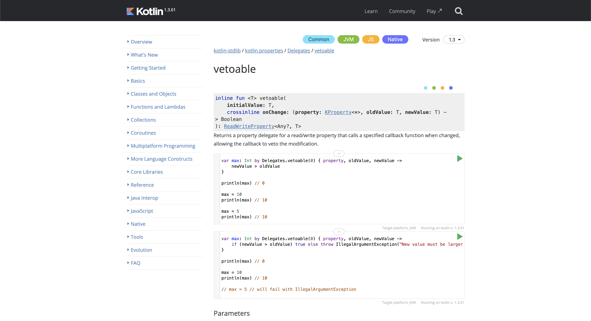
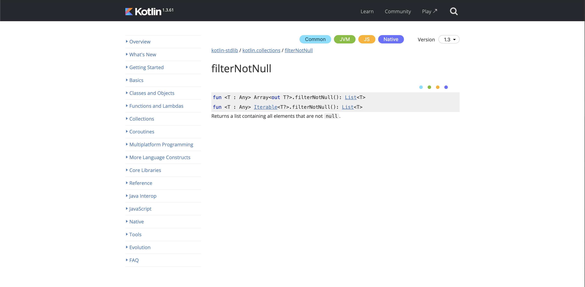

The Kotlin language used by Android developers all over the world is open source and available on [GitHub](https://github.com/jetbrains/kotlin). This means it's open for contributions from anyone! It may, of course, feel very intimidating to contribute to a project of that size. Especially for those of us who are new to open source contributions. 

The JetBrains team makes this process a lot less scary than it sounds. There are some beginner friendly ways to contribute to the language, and this post will walk you through every step.

<!--more-->

---

This post is adapted from a [presentation](https://speakerdeck.com/brianplummer/adam-mcneilly) I gave with my coworker [Brian Plummer](https://twitter.com/plummermakes).

---

# Where To Start

Trying to decide where to start when contributing to a project like Kotlin feels like a task by itself. It's a large project, with tons of contributors, managed by both the team at JetBrains and the developer community. 

Thankfully, in the Kotlin issue tracker YouTrack, we have a tag called [Up For Grabs](https://youtrack.jetbrains.com/issues?q=tag:%20%7BUp%20For%20Grabs%7D) which will show you all of the tasks that JetBrains is requesting community help with. 

There's one in particular that JetBrains is constantly requesting help on. That is to [provide samples for all standard library functions](https://youtrack.jetbrains.com/issue/KT-20357). Not all of the standard library has code samples yet, and this is a great way for you to make both a quick and impactful contribution to the language.

# Getting Set Up

Now that we've decided on the contribution we're going to make, we need to get ourselves set up and ready to contribute. There's a couple things we should do before we start writing our code samples.

1. Make sure you check the [contribution guidelines](https://github.com/JetBrains/kotlin/blob/master/docs/contributing.md).
2. Fork the repository and make sure you can [build the project](https://github.com/JetBrains/kotlin#build-environment-requirements).

# Finding Samples To Write

Unfortunately, there's no easy well to tell which parts of the standard library have samples or not. It's a little bit of trial and error clicking through the documentation. 

If a function does have samples, you'll see them as code blocks beneath the method: 



If a function is lacking in samples, all of this space will be blank:



In this post, we're going to look at both of these samples, because each one is a little different. 

# Vetoable Sample

All of the samples for the Kotlin documentation are in the `kotlin/libraries/stdlib/samples/test/samples` directory. From there, they are all grouped by related functionality: 


Since [Vetoable](https://kotlinlang.org/api/latest/jvm/stdlib/kotlin.properties/-delegates/vetoable.html) is a property delegate, we'll put it inside a file called `delegates.kt`. 

## Understanding Vetoable

If you're unfamiliar with this property delegate, it is one that allows you to specify a callback that will have the opportunity to veto any new property values. An example use case of this would be to keep track of a maximum integer, and make sure we only update the property if the new value is actually greater than the old one. 

## Writing The Sample

When writing the sample, it's important to first plan how you want to explain the concept of the method under test. In our max scenario, we can do this in three steps:

1. Start by ensuring the default value is printed.
2. Assign a new value larger than our default and ensure the property is updated.
3. Assign a new value smaller than the previous one and ensure the property did not update. 

Here is what that sample may look like:

```kotlin
// kotlin/libraries/stdlib/samples/test/samples/properties/delegates.kt

fun vetoableDelegate() {
    var max: Int by Delegates.vetoable(0) { property, oldValue, newValue ->
        newValue > oldValue
    }

    assertPrints(max, "0")

    max = 10
    assertPrints(max, "10")

    max = 5
    assertPrints(max, "10")
}
```

Now, in order for this sample to appear in the fancy runnable code block, we also need to make sure we annotate it with `@Sample`. We don't need to worry about how this works under the hood, but if you're curious, you can look at the Kotlin documentation tool, [Dokka](https://github.com/JetBrains/kotlin-dokka-stdlib).

```kotlin
@Sample
fun vetoableDelegate() {
    // ...
}
```

If you'd like to see the full list of property delegate samples, you can find them on [GitHub](https://github.com/JetBrains/kotlin/blob/master/libraries/stdlib/samples/test/samples/properties/delegates.kt).

## Linking To The Sample

Once you've written your sample, we need a way to connect it with the actual method in the standard library. We do that by finding the method source, and providing another annotation with the fully qualified path to our sample:

```kotlin
// kotlin/libraries/stdlib/src/kotlin/properties/Delegates.kt

/**
 * Returns a property delegate for a read/write property that calls a specified callback function when changed,
 * allowing the callback to veto the modification.
 *
 *  @sample samples.properties.Delegates.vetoableDelegate
 *  @sample samples.properties.Delegates.throwVetoableDelegate
 */
public inline fun <T> vetoable(...): ReadWriteProperty<Any?, T>
```

If you want to see the full source for vetoable, you can find it on [GitHub](https://github.com/JetBrains/kotlin/blob/master/libraries/stdlib/src/kotlin/properties/Delegates.kt#L37-L55).

# FilterNotNull Sample

Some of the Kotlin standard library is actually created from generated code. The reason for having a [standard library code generator](https://github.com/JetBrains/kotlin/tree/master/libraries/tools/kotlin-stdlib-gen) for Kotlin is to provide useful extension functions that can apply to multiple types: arrays, lists, sequences, etc. Many of the collections related functions in the standard library are created from templates.

## Writing The Sample

Despite being a sample for generated code, we can put our sample in the same directory as the ones before. In this example, we just want to demonstrate that we can have a list of nullable items, and parse out a list of only the non-null items.

```kotlin
// kotlin/libraries/stdlib/samples/test/samples/collections/collections.kt

@Sample
fun filterNotNull() {
    val numbers: List<Int?> = listOf(1, 2, null, 4)
    val nonNullNumbers = numbers.filterNotNull()

    assertPrints(nonNullNumbers, "[1, 2, 4]")
}
``` 
## Linking To The Sample

Since the method under test is a generated file, linking to it is a littler trickier than finding the method source. Instead, we have to find the template the method is generated from. You can find these in the `kotlin-stdlib-gen` module. In this case, the template is in `kotlin/libraries/tools/kotlin-stdlib-gen/src/templates/Filtering.kt`. Once there, we'll find the `filterNotNull` template, and add a reference to our sample inside the method builder:

```kotlin
val f_filterNotNull = fn("filterNotNull()") {
    // ...
} builder {
    sample("samples.collections.Collections.Filtering.filterNotNull")
    // ...
}
```

Once we've done that, we need to be sure to run the `./gradlew :tools:kotlin-stdlib-gen:run` command, which will also add this sample to the relevant generated methods.

# Validate Changes And Make A Pull Request

Once you've made the relevant changes in your fork, you can validate your changes by running the gradle command: `./gradlew coreLibsTest`. If this passes, you're ready to contribute your changes. Note that these are tests - which brings up a cool fun fact about this process. All of the samples are also unit tests, which means we can simultaneously produce better documentation, and increase code coverage for the language. 

You can make a pull request to the [Kotlin repo](https://github.com/JetBrains/kotlin/pulls). In the PR title and/or description, make sure you include a link to the [sample request YouTrack](https://youtrack.jetbrains.com/issue/KT-20357) issue. Be open to feedback from the JetBrains team - keeping in mind that they are here to help, and always appreciate support from the community. 

# Recap & Resources

Before this post, contributing to Kotlin may have seemed like a very daunting task. I hope that by the end of it, you see that there is a great beginner friendly process in place for anyone to start contributing! If you'd like to contribute these samples, don't forget these resources:

1. [The YouTrack issue](https://youtrack.jetbrains.com/issue/KT-20357) requesting samples.
2. [The pull request](https://github.com/JetBrains/kotlin/pull/1426) for the vetoable sample above, along with other property delegates.
3. [The pull request](https://github.com/JetBrains/kotlin/pull/3123) for the filterNotNull sample above.
